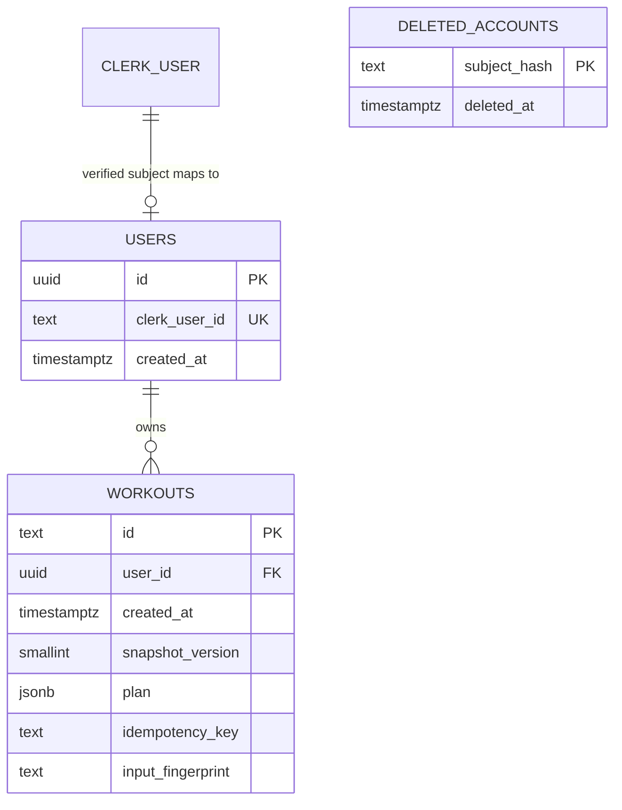

# Accounts and saved workouts

Clerk owns authentication. Endorphins owns application data. There is no local password, refresh-token, or duplicate session table.

`deleted_accounts` is deliberately separate from active users. It retains a SHA-256 digest of the Clerk subject after erasure; it contains no workout snapshot or raw Clerk user ID.

## Identity and sessions

The Clerk CLI links this project to the Endorphins app (`app_3K5z4w8PFdIMSXl1sR7bXIDV6EV`). Its TanStack Start middleware and provider manage browser sign-in, sign-up, session refresh, account switching, profile controls, and sign-out. Development credentials live in the ignored `frontend/.env.local` file written by the CLI. Only the publishable key may appear in a browser bundle.

Browser API calls obtain a fresh token from the specific Clerk session resource, then send `Authorization: Bearer …` through the same-origin proxy. Go verifies the signature and token times using the Clerk SDK, requires a user subject, session ID and expiry, checks the exact instance issuer derived from the publishable key, and restricts `azp` to `APP_ORIGINS`. Pending/non-active session claims are rejected. Older session tokens without `sts` remain supported. Cookies and client-supplied user IDs do not authorize the Go API.

Verification uses Clerk's cached public signing keys. It does not make a Clerk session lookup on every request: session revocation is reflected as short-lived tokens expire. A processed account-deletion webhook also blocks otherwise valid stale tokens through the local tombstone. Tokens, passwords, and secrets are never stored in Postgres or application browser storage. Clerk owns its own session storage and lifecycle.

Private routes use a server auth check before navigation and also withhold their contents if the browser session disappears. These screens fetch their data on the client; Go remains the authorization boundary. The canonical query-key factory scopes profile, workout lists, summaries, details, exports, and generation mutations to the Clerk session ID. On sign-out or account switching, the previous session's requests and caches are cleared, and page state is remounted. Late responses cannot replace the new account's data. Auth-dependent HTML and API responses are not publicly cacheable.

## Application users

The first authenticated API request resolves `sub` to `users.clerk_user_id`. Resolution and erasure acquire the same per-subject transaction lock. Resolution checks the deletion digest, returns an existing user without rewriting it, or inserts a user. Simultaneous first requests return the same internal UUID; a first request racing a deletion cannot recreate the account after erasure commits.

`users.id` is the stable key for application relationships. Future favorites, completed sessions, preferences, and progress records should reference it. Never use email, display name, or a browser-provided owner ID as the relationship key. Clerk remains the source for email and profile details; no stale mirror is stored just to populate unused columns.

`GET /api/v1/me` returns the current internal user and Clerk linkage. Provisioning is lazy, so a Clerk account that has never called the API may not yet have an Endorphins row. The `/account` screen shows its creation date and application reference, links back to the library, and provides an application-data download. Clerk's profile menu owns sign-in/profile management.

## Workout ownership and retries

`POST /api/v1/workouts` generates a plan and inserts it for the authenticated internal user. It returns `201 Created` with `Location` only after persistence succeeds. A successful new generate or shuffle action creates a separate saved workout.

The optional `Idempotency-Key` header binds one save attempt to its owner and generation input. Keys contain 1–128 visible ASCII characters. Replaying the same owner/key/duration/level returns the exact original saved workout and the same resource location, also with `201`. Reusing that key with different input returns `409` and `idempotency_conflict`. A unique owner/key constraint and a single conditional SQL upsert enforce this under concurrent requests; failed inserts do not reserve a key. Keys remain with their workout until account erasure.

The frontend retains the key across a manual retry of a failed attempt with unchanged preferences. Success, resetting the attempt, or changing preferences starts a new action. The key is local to the mounted view; reloading the page starts a new attempt. Mutations are not automatically retried. The backend also accepts requests without a key, which create an independent plan each time.

## Historical snapshots and API models

The `plan` JSONB column preserves level, requested duration, warm-up, total and per-block estimates, focus, sets, exercise descriptions, reps, timed rounds, and rests. History reads this snapshot without recalculating it. Edits to the source catalogue or estimate formulas do not change old workouts. The generator's existing opaque random text IDs are retained; the database supplies creation timestamps.

Storage has an explicit version-1 encoder/decoder with its own structs. Every read selects `snapshot_version`; an unsupported version fails explicitly. Public request/response DTOs live in `internal/api/v1`, with resource-specific request/response conversions beside the DTOs. Changing an HTTP field or domain struct therefore does not silently change the historical storage format. `api/openapi.json` defines the public contract and generates frontend types.

## Search, pagination, and summaries

`GET /api/v1/workouts` returns `{ items, nextCursor }` and searches all matching records owned by the caller, independently of the pages already loaded in the browser. It accepts:

| Parameter | Meaning                                                                                                                                                         |
| --------- | --------------------------------------------------------------------------------------------------------------------------------------------------------------- |
| `q`       | Trimmed, case-insensitive literal substring across focus, block names, and exercise names; at most 200 Unicode characters. `%` and `_` are ordinary characters. |
| `level`   | Optional level 1–5; omission includes every level.                                                                                                              |
| `sort`    | `newest` by default, or `shortest` by estimated minutes.                                                                                                        |
| `limit`   | 1–50 records, default 20.                                                                                                                                       |
| `cursor`  | Opaque continuation position for the same owner, normalized filters, and ordering.                                                                              |

Newest ordering uses `(created_at DESC, id DESC)`. Shortest ordering uses estimated minutes ascending, then the same timestamp/ID tie-breakers. Cursors carry the relevant position and a scope digest; changing owner, filters, or order requires starting a new first page. An empty `nextCursor` means the final page. Cursors are positions, not credentials: SQL still checks the authenticated owner on every request.

`GET /api/v1/workouts/summary` applies the same `q` and `level` filters to the complete library. It returns matching `count`, total estimated `plannedMinutes`, `averageMinutes` (zero for an empty result), and five `{ level, count }` entries including zero counts. These describe generated plans, not completed training. Library filters and sorting live in validated route search, so refresh and browser navigation restore the view.

`GET /api/v1/workouts/{id}` applies both owner and workout ID in SQL. Missing and other-account IDs both return `404`. There is no unscoped repository read method, public share link, or workout-edit endpoint.

## Export and account erasure

`GET /api/v1/me/export` returns a versioned JSON download containing the application user, all owned workout snapshots, and an export timestamp. A read-only, repeatable-read transaction gives the export a consistent database view. It does not export Clerk-held credentials or profile information. The account screen fetches it with the captured session's bearer token, verifies the returned application owner, downloads a Blob, and discards the payload. Switching sessions suppresses a late download from the previous account.

`POST /api/webhooks/clerk` accepts verified Clerk/Svix deliveries without requiring a browser session. It verifies the signature and timestamp over the raw, size-bounded body before decoding. A `user.deleted` event records the subject digest and deletes the application user in one transaction; the workout foreign key cascades the deletion. Duplicate deletions are harmless. A deletion received before initial provisioning still records a tombstone. Other verified event types are acknowledged without changing application data.

The receiver is implemented, but its external Clerk endpoint subscription and signing secret still need deployment configuration. Delivery is asynchronous; erasure occurs when a valid deletion event is processed. Erasure failures return an error so the provider can retry. There is no separate application-only deletion button: account deletion is managed through Clerk and synchronized by the verified event.

Tombstones currently have no automatic expiry. They retain only the subject digest and deletion time to prevent stale sessions or late events from reprovisioning an erased account; they remain security-related retained data. Database backups and restored copies require a separate retention and erasure-reconciliation policy. Deleting the live row does not rewrite old backups. See the [deployment runbook](deployment.md) before enabling public accounts. Billing and media storage remain separate future work.

## Storage and migrations

- `repositories/catalogue` is the concrete read-only filesystem store.
- `repositories/postgres` owns pool configuration, explicit parameterized SQL, snapshot codecs, and atomic storage operations.
- `services/account`, `services/library`, and `services/workout` own small consumer-side interfaces and application behavior.
- Handlers consume small service interfaces and return public DTOs through their resource response constructors.
- `internal/app` wires constructors and closes the pool after HTTP shutdown.
- Embedded SQL migrations run explicitly through `cmd/migrate`, using golang-migrate's version table, database lock, and dirty-state handling. API startup never migrates implicitly.

The current API requires clean schema version 2, both at startup and in its database-aware `/readyz` probe. `/healthz` reports process liveness separately. Run migrations before deploying a matching API binary. A future schema change adds a migration; do not edit an already applied migration or silently reset a database to clear a dirty state.

## Verification

Go tests retain the invariants that browser flows cannot efficiently prove: deterministic generator behavior, signed JWT rejection cases, historical snapshot compatibility, real Postgres constraints, cancellation, owner isolation, pagination ties, concurrent idempotency, provisioning/deletion races, erasure rollback, and schema readiness. Database tests use isolated Testcontainers databases under the race detector.

The hermetic Playwright suite builds a disposable real stack: the integration-only Go fixture, ephemeral signing keys, a migrated Postgres container, the TanStack application, and the production Bun SSR/static/proxy entry point. Each test has an isolated account. Desktop and mobile projects exercise generation, saving, detail/reload, failed shuffle recovery, URL filters, account isolation, exports, accessibility interactions, layout, reduced motion, and print behavior. Contract checks validate actual responses against OpenAPI, including idempotency and a signed deletion event traveling through the production proxy.

Only the external Clerk UI/session adapter is substituted at build time for hermetic runs. Go's real JWT verifier still validates fixture tokens, and the private server guard calls the real API. The normal release build uses Clerk adapters and excludes the fixture binary and test identity modules. Browser tests block external network requests and retain failure artifacts. Actual Clerk signup, login, profile changes, and externally delivered webhooks still require a configured development-instance check; local fixtures do not claim to test Clerk itself.
