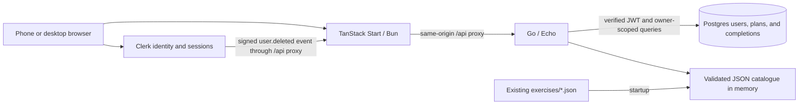

# Endorphins architecture

Updated October 9, 2026. This describes the current application. Earlier changes are recorded in the [Temper comparison](temper-architecture-comparison.md).

## Product

Signed-in users generate home workouts from the Python tool’s five JSON catalogues. Inputs are an integer duration of 30–120 minutes and a level of 1–5. Plans contain legs, upper-body, and core blocks with sets, repetitions or timed rounds, rest, notes, and estimated duration. Plans save to the account. Users can reopen, shuffle with the same preferences, and print them.

The optional exercise view steps through a plan. A separate finish screen records completion after confirmation. Billing, Backblaze, guided timers, and offline installation are deferred. Hosting and the external Clerk webhook subscription need deployment setup.

## Runtime



Start renders pages; the browser calls Go through TanStack Query. Each router has one QueryClient. SSR loaders do not fetch relative API URLs. Vite proxies `/api` in development; Bun serves production assets and the same proxy. Go binds to loopback by default. Private pages fetch on the client after a server auth guard. Each API request carries a Clerk bearer token, which Go verifies. Clerk serves its own identity requests. The public deletion webhook verifies the raw-body Svix signature and timestamp.

## Stack

| Area           | Implemented                                                                                   |
| -------------- | --------------------------------------------------------------------------------------------- |
| Go             | 1.27.1, project toolchain; exact compiler also selected for the linter                        |
| HTTP           | Echo v5.4.0, request IDs, recovery, structured request logs                                   |
| React          | 19.3.0                                                                                        |
| Routing        | TanStack Start 1.168.59 / Router 1.170.40                                                     |
| Remote state   | Query 5.104.0 / SSR bridge 1.167.3                                                            |
| Styling        | Tailwind 4.3.3 utilities, semantic tokens and locally served fonts                            |
| Runtime/build  | Bun 1.4.2, Node 26.10.0, Vite 8.3.1                                                           |
| Authentication | Clerk TanStack Start SDK 1.6.3 / Go SDK v2.7.0; Svix v1.99.1 for webhook verification         |
| Persistence    | Postgres 17, GORM v1.31.2 / Postgres driver v1.6.3, pgx v5.11.0, golang-migrate v4.20.1 |
| Database tests | Testcontainers Go v0.44.0                                                                     |
| Browser tests  | Playwright 1.61.0, desktop Chromium and Pixel 7 mobile emulation                              |
| Contract       | OpenAPI 3.0.3, generated TypeScript with openapi-typescript 7.13.0                            |
| Checks         | strict TypeScript, Oxlint, React Doctor 0.9.17, Prettier, Go race tests, golangci-lint 2.14.0 |

The frontend versions follow the inspected Postmaker migration in `/Users/lchui/.codex/worktrees/1825/postmaker`, HEAD `ec8e694224e8f1db3e26b2b8133fe6e129bf94ad`. Shared primitives use native controls. The app does not need TanStack Form, Base UI, or Zustand.

Go 1.27.1 was verified against [official downloads](https://go.dev/dl/) and downloaded successfully during implementation. Echo’s [v5 quickstart](https://echo.labstack.com/docs/quick-start) was checked before setup. Lockfiles pin the resolved application dependencies.

## Repository structure

```text
api/openapi.json
frontend/
  Dockerfile                 # Shared production/e2e image build
  app/
    auth/                    # Production Clerk client/server adapters
    routes/                  # Routes, validated URL state, screen composition
    pages/                   # Public landing composition
    components/ui/           # Controlled buttons, fields, feedback, presence
    components/workout/      # Workout-specific builder, library, plan, exercise view
    components/auth/         # Account controls, auth layout, session boundary
    server/auth.ts           # Private-route server auth check
    hooks/                   # Query/mutation policy, export, print behavior
    services/                # HTTP, account/workout transport, keys, pure helpers
    types/api.gen.ts          # Generated from OpenAPI
    router.tsx               # Per-router QueryClient
    app.css                  # Tailwind theme, fonts, base rules, keyframes, print setup
  test/                      # Focused unit tests and build-only identity fixtures
  scripts/check-boundaries.ts # Frontend dependency and primitive ownership checks
  server.ts                  # Bun SSR/static server and bounded same-origin proxy
e2e/
  setup.ts                   # Disposable Postgres/API/frontend lifecycle
  harness/                   # Testcontainers image build, network and app lifecycle
  fixtures.ts                # Per-test identities and local-only network policy
  specs/                     # Browser flows and actual HTTP/OpenAPI contracts
  playwright.config.ts       # Desktop/mobile projects and failure artifacts
backend/
  Dockerfile                 # Shared production/e2e image build
  cmd/api/main.go            # Signals, config, application entry point
  cmd/migrate/main.go        # Explicit versioned schema migration
  internal/
    api/v1/                 # Public request/response DTOs and error envelope
    app/                    # Constructor wiring and shutdown ownership
    config/                 # Grouped go-flags configuration
    server/                 # Routes, middleware, central error mapping, probes
    handlers/               # HTTP decoding/status/headers and consumed service interfaces
    services/workout/       # Pure generation and consumed catalogue port
    services/account/       # Identity resolution, erasure, and export
    services/library/       # Account-owned generation, queries, and cursor scope
    integrations/clerk/     # JWT verification and verified deletion webhook
    domains/                # Application values and pure workout rules
    repositories/catalogue/ # Concrete filesystem store
    repositories/postgres/  # Stores, versioned snapshots, and query tests
      migrations/           # Embedded versioned schema migrations
    testfixtures/           # e2e-tag-only Clerk signing and workout seed helpers
exercises/                  # Original catalogue, shared with Python
scripts/                    # Development lifecycle and backend layer checks
```

`internal/services` groups use-case modules; it contains no Go package. Each package owns its behavior and the interfaces it consumes. Workout generation lives beside `Service`, `New`, and the small `Catalogue` interface.

## Dependency rules

Handlers declare small interfaces for the service methods they consume. Resource DTO files in `internal/api/v1` own `ToInput` and `New…Response` conversions. Request/response types are separate from business rules and stored snapshots; the API layer can depend inward on service inputs and domains. Services use domain values and their own small interfaces. Repositories satisfy those interfaces structurally, without importing services. Storage snapshot structs are independent of public DTOs and domain serialization, so API changes do not redefine old plans. The application root constructs the repository, service, handler, and server explicitly. Domain code depends only on the standard library.

Services cannot import Echo, handlers, server, repositories, application setup, integrations, or configuration. Repositories cannot import services or HTTP layers. Handlers cannot construct storage or depend on the server. `scripts/check-layers.py` enforces these rules, including transitive imports, in `make check`.

Frontend import rules also run as part of linting. UI primitives and pure services cannot depend on application hooks/routes; hooks own remote-state policy; product components compose primitives. Motion ownership stays in the UI library. The checks keep dependencies explicit.

Frontend lint runs the pinned React Doctor full scan. CI fails on errors or warnings. The scan shares the generated-file exclusions in the Oxlint config and uses no remote score or supply-chain service.

`POST /api/v1/workouts` persists a resource and returns `201` with its retrieval URL. Optional owner/input-scoped idempotency keys replay the saved result; a conflicting input receives `409`. Authenticated reads include `/api/v1/workouts`, `/api/v1/workouts/summary`, `/api/v1/workouts/{id}`, `/api/v1/me`, and `/api/v1/me/export`. Errors use safe `{message, code, requestId}` envelopes. The server generates the correlation ID; structured internal logs retain unexpected causes while responses expose safe copy.

`GET /healthz` is process liveness. `GET /readyz` checks the database and clean supported schema version with a two-second bound. Startup validates both catalogue and database schema. See [the account and workout model](accounts-and-workouts.md) for ownership, cursors, snapshots, idempotency, and deletion semantics; see [deployment](deployment.md) for operational setup.

## Generation policy

1. Validate duration and level before loading the catalogue.
2. Sample three distinct leg exercises, three upper-body exercises, and four core exercises.
3. Reserve five warm-up minutes for requests of at least 45 minutes, preserving the script’s threshold.
4. If a demanding initial sample exceeds the budget, remove its costliest exercise until it fits, retaining every body area.
5. Add whole sets or previously unused exercises while they fit. Prefer another set approximately 70% of the time when both choices are possible.
6. Return the actual estimated total, including warm-up, and the body area with the largest time allocation.

Repetition-based estimates retain the original easy/medium/hard values of 1/2/5 minutes. Interval estimates round up full work/rest rounds and add one transition minute. The generator never pads a plan with invisible time and never exceeds the requested estimate. A plan can finish a few estimated minutes below the request.

Random choices are local to each calculation and use concurrency-safe randomness in production. Deterministic tests supply an integer generator. Shared catalogue slices are not mutated. Startup validates every catalogue file, so missing or invalid data prevents readiness.

## Frontend ownership

Reducers own local UI transitions. Query mutations own confirmation and Undo results. Refs hold retry keys and generation attempts. Theme and test identity use `useSyncExternalStore` with stable browser snapshots and fixed server snapshots. Print listeners use a callback ref with cleanup when the plan element leaves the page. A keyed session boundary clears private caches on unmount. The app route records its requested return URL in route context before rendering an onboarding redirect with `Navigate`. Frontend lint rejects `useState` and `useEffect`, including aliases and property access; it checks application code, scripts, and test adapters.

Validated URL search owns builder minutes/level and library query/level/sort. The custom-duration input keeps an editing draft so intermediate values can be typed; only valid integers update route state. Library search typing replaces the current history entry, while deliberate filter/sort navigation can be revisited with back/forward. The default 45-minute duration is omitted from the URL. An explicit level remains so links do not depend on another account's saved preference. Changing filters selects a new query key and starts a fresh page.

Hooks own fetching, pagination, retries, and mutations. `services/http.ts` owns authenticated transport, cancellation/deadlines, and safe error parsing; account and workout transport are separate modules. One key factory scopes every private query and mutation to the Clerk session. Generating a workout seeds its detail cache and invalidates all list/summary variants only if the originating session remains current.

Setup owns generation input. The saved-plan route owns the displayed plan and local exercise/disclosure state. Postgres owns history. A failed shuffle keeps the previous plan; a successful shuffle saves a new plan with the same preferences. Writes are not retried automatically. Manual retries keep one idempotency key until success, reset, or changed preferences. The completion hook owns confirmation, Undo, and key rotation. It shows a saved completion before refreshing analytics.

The library fetches filtered, ordered records and a count across all matching saved plans. Loaded pages only determine which cards are currently displayed. Summary counts and estimated minutes never imply completed activity. The `/app/account` screen shows application account details and downloads a consistent owner-scoped export; late downloads are suppressed after a session switch.

## Design system

`components/ui` is the controlled primitive library: native buttons and link presentation, fields/inputs/selects/search/radios, error/retry feedback, loading/empty states, local date display, and Presence transitions. Button styles live outside the component so Fast Refresh can preserve state. `LocalDate` uses TanStack's `ClientOnly` with a fixed date fallback before hydration. Presence uses `LazyMotion` with animation features. These components own presentation and interaction contracts; callers own application values, routing, and requests. Native exercise disclosures remain workout-specific components.

`app.css` contains font loading, semantic Tailwind tokens, base rules, and keyframes. It is the only application stylesheet. Shared primitives own control styles and states through Tailwind utilities; layouts and responsive/print variants stay beside their markup. The palette supports light and dark schemes. Shared controls preserve readable text, keyboard focus, disabled/pending behavior, and touch targets. Motion follows the shared reduced-motion policy.

Successful generation focuses the plan title and scrolls to it at mobile widths, respecting reduced motion. Print opens disclosures temporarily and restores them afterward. Fonts and photography are served locally. The display face is the Sharp Serif Text PDF preview recovered from the supplied specimen, paired with Inter; the original font package is still needed for public release. [The design system](design-system.md) defines tokens and control contracts. Its development gallery is `/design-system`.

Mobbin informed information hierarchy; the [Paper file](https://app.paper.design/file/01M3TVV9XXTXF2N7ZD43K3WH3V) stores desktop/mobile studies. Reconcile Paper changes with the app’s tokens and control contracts.

## Verification and release isolation

Test each invariant through its owning module’s interface. Keep algorithm/JWT cases and SQL races in focused package tests. Browser tests cover product behavior and OpenAPI responses through the production proxy.

The [browser harness](../e2e/README.md) uses the application Dockerfiles and entry points. It owns disposable containers, a private network, random ports, failure cleanup, and artifacts. Playwright runs on the host and blocks external browser requests.

Only the external Clerk adapters change in `e2e` builds. `internal/testfixtures` supplies signing keys and fixture routes. Real JWT/webhook verifiers, owner-scoped queries, wiring, and migrations stay in use. Release import checks reject test fixtures, and frontend release checks reject test identity code. Real Clerk signup and provider webhook delivery need separate integration checks.

Postgres tests use one migrated container per package, created by `TestMain` in `repositories_test.go`. Serial resource tests reset rows before each case. Schema and migration tests use temporary databases within that same container. These tests call repositories directly and cover SQL behavior; browser tests own full HTTP journeys.

Repositories use GORM for reads, writes, joins, filters, cursor ordering, row locks, and conditional upserts. Persistence rows stay inside the Postgres package; domains and services have no ORM dependency. List and summary share one owner/search filter. Completion joins include both owner and workout IDs. Database defaults generate account/completion UUIDs and creation/confirmation timestamps. The API supplies UTC timestamps for the first onboarding and Undo operations under row locks. GORM runs explicit transactions for account lifecycle operations, child writes, exports, and activity snapshots.

Migration 5 backfills workout level, estimated minutes, and an owned search-term table from immutable snapshots. Saves write these fields and lowercased focus, block, and exercise names in the same transaction. Retries retain the original plan and its search terms. GORM filters and orders these columns, and joins search terms on both owner and workout ID. Distinct results prevent duplicate matches. Summary reads only matching IDs, levels, and minutes and folds totals in Go. Activity counts all active completions in Postgres, then groups timestamps into four local calendar weeks in Go. Its timestamp query spans 30 UTC days to cover all zone offsets; only dates in those four weeks count.

The unique deletion-digest key serializes account resolution and erasure. Resolution inserts a transient guard and removes it before commit. Erasure keeps the tombstone and deletes owned search terms with the other child records. Application and test queries contain no SQL statements or expressions. Integration fixtures use GORM, callbacks for failure injection, and the real historical migration files. Temporary databases use Postgres `createdb` and `dropdb` inside the test container. Only versioned migrations remain as `.sql` files. GORM uses pgx through its Postgres driver; startup never calls `AutoMigrate`.

## Signup, onboarding, and activity

The public `/` landing page has its own header and footer. `/app` uses compact app navigation and an activity dashboard. Private routes pass the requested app URL through the server auth guard. After signup, `/app/onboarding` introduces floor/wall home workouts and saves one of five default levels: Light, Steady, Lively, Tough, Fiery. The account stores the level and first onboarding timestamp. Profile errors show recovery rather than redirecting into onboarding. The first setup is `/app/new`; explicit URL settings override the saved level. Old `/workouts` and `/account` links redirect to the app routes.

Generation saves an immutable plan and opens `/app/workouts/{id}`. The optional exercise view and the direct **I finished** action open `/app/workouts/{id}/finish`. Only an explicit confirmation writes a completion. Reusing a plan with a new confirmation creates another completion. Network retries reuse the operation key. Undo voids that record and keeps the key, so a delayed retry cannot restore it. The saved plan remains available.

`GET /api/v1/activity` uses the browser's IANA time zone. It returns completed-workout totals, distinct active days in the current Monday-start week, four weekly counts, and five recent completions. Queries use a consistent database snapshot and owner scope. Milestones are derived at 1, 5, 10, 25, and 50 completions. Empty dashboards explain the next action; charts appear after completion. Saved-plan counts stay in the library. No elapsed time, calorie estimate, streak, or exercise-level logging is inferred.

The Go catalogue adapter excludes weight movements and chair dips from new plans, and handstands from levels 1–2. It filters before all generation choices and validates the remaining pool at startup. The original JSON/Python catalogues and stored snapshots remain unchanged. The app remains on one origin; a separate released app domain is deferred.
